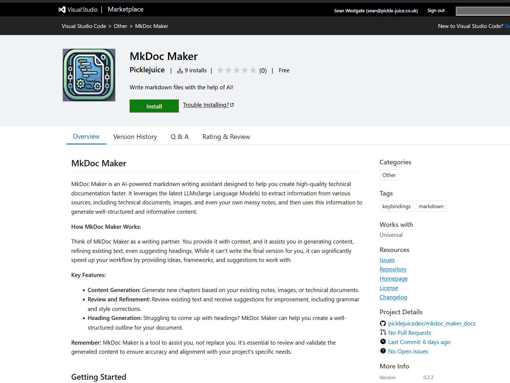

+++
date = '2025-03-20T12:49:08Z'
draft = false
title = 'Images'
+++

# Using Image references

To include images in your Markdown files, use the standard Markdown syntax:

```markdown

```

MkDocMaker treats images referenced this way the same as images stored in your project's resource folders during content generation. For example, consider this Markdown document:

```markdown
# MkDocMaker

## Installing the extension


```

In this case, `marketplace.png` will be displayed in the Markdown preview and included when MkDocMaker generates the chapter.


